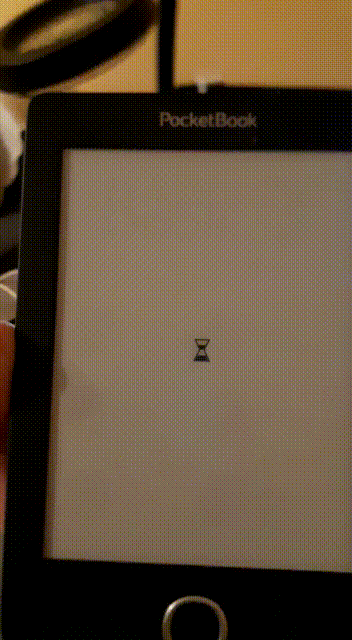

# pocketbook-bootloop-fix


Code and instructions on fixing Pocketbook boot loop(hourglass animation)

## What causes the boot loop
Pocketbook devices boot from a micro SD card that is placed and glued in a slot inside the device.

This micro SD card contains the Linux OS and the e-reader applications.

Every book that you copy to the device will also be stored on a partition of this SD card.

Unfortunately the data on the SD cards can become corrupted and prevent the device from booting.

When this happens the device will show an eternal hourglass animation on the screen.

This issue was observed by me and many others.

For me it happened when I tried to copy ~100MB of books to the device through the micro USB port.
The SD card(Gigastone) I found in my Pocketbook Basic 3 didn't seem to be of quality and it's probably the same case for other Pocketbooks as well.

## How to fix the issue
The first thought in case of card corruption is to clone the card of a known working device and use it in your device.

This is not enough in the case of Pocketbook devices.

Pocketbook devices are bounded to their SD cards. If you replace the card with one from an identical device, you will still be stuck in a boot loop.

The main application of the Pocketbook will:
- read the SD card's serial number(set by SD card's manufacturer)
- read the device's serial number from an internal memory(probably display's flash)
- compute a hash over the above two serial numbers
- compare the hash with the hash stored in file `.freezestatus` that is stored in the 9'th partition of SD card
- if computed hash matches the one in `.freezestatus` it will boot, otherwise it stays stuck displaying hourglass animation

The code attached here will create for you the `.freezestatus` file with the correct 4 bytes hash.

This way you can use the old SD card or a new one with the device.

To get your SD card's serial number, connect the SD card to a laptop, computer or dev board with SD card slot.
Computer must run Linux.

Using USB-SD card adapters doesn't work. Native MMC interface is needed.
```
cat /sys/block/mmcblk0/device/serial
```

To get the Pocketbook's serial number, you will read it from the sticker on the inside of the back lid.

Now generate the `.freezestatus` file.
First compile the code for Linux:
```
cd Linux
make
```
Then user `serial` compiled tool to generate the binary.
Replace in the command bellow `POCKETBOOK_SERIAL_NUMBER` and `SD_CARD_SERIAL_NUMBER` with the values you got from previous steps.
```
./serial/serial --serial_number POCKETBOOK_SERIAL_NUMBER --sd_serial SD_CARD_SERIAL_NUMBER
```

Example command for my device:
```
./serial/serial --serial_number YTC71100008200W000E4 --sd_serial 0x48828066
```

Now copy the generated `.freezestatus` file to the partition with index 9 of your SD card and boot.

In the case of my Pocketbook, I fixed it by copying the data from the original SD card to a new one and restoring the `.freezestatus` file with the steps described above.

### Windows users
There are Windows x86/x64 precompiled binaries attached in the repository.

I never tested them and I don't know how to read the SD card serial number on Windows.

You are on your own.

## About the code
Code is not written by me. I found it on the forums while browsing for fixes of the issue.

https://www.mobileread.com/forums/showthread.php?t=278728&page=4

The code comments and license infos are written in Cyrillic alphabet.

`GPLv3` is mentioned there.

I take no credit for the code. This is just my attempt to upload the code on a public channel rather than forums and to centralize the fixing instructinos.

## Alternative OS
If you are into embedded development, I also wrote some instructions on how to build Yocto Linux for the Pocketbook.

https://github.com/spanceac/meta-pocketbook

